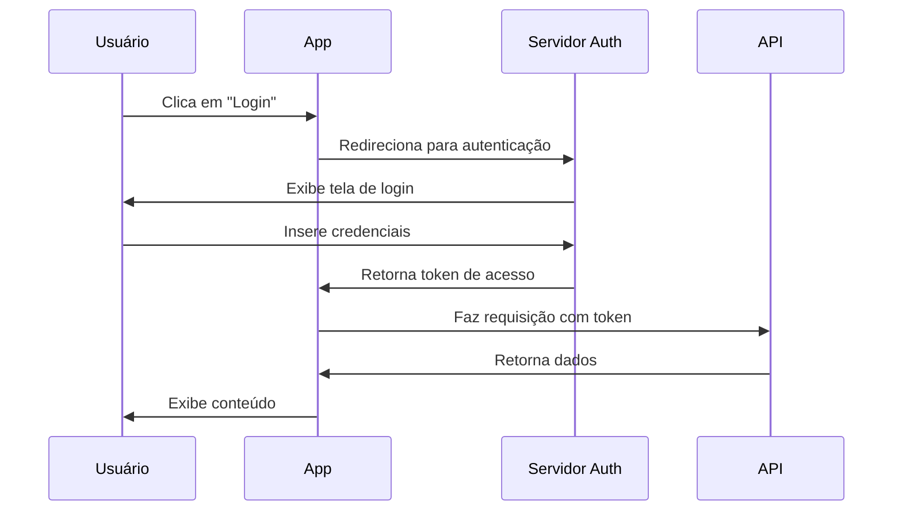
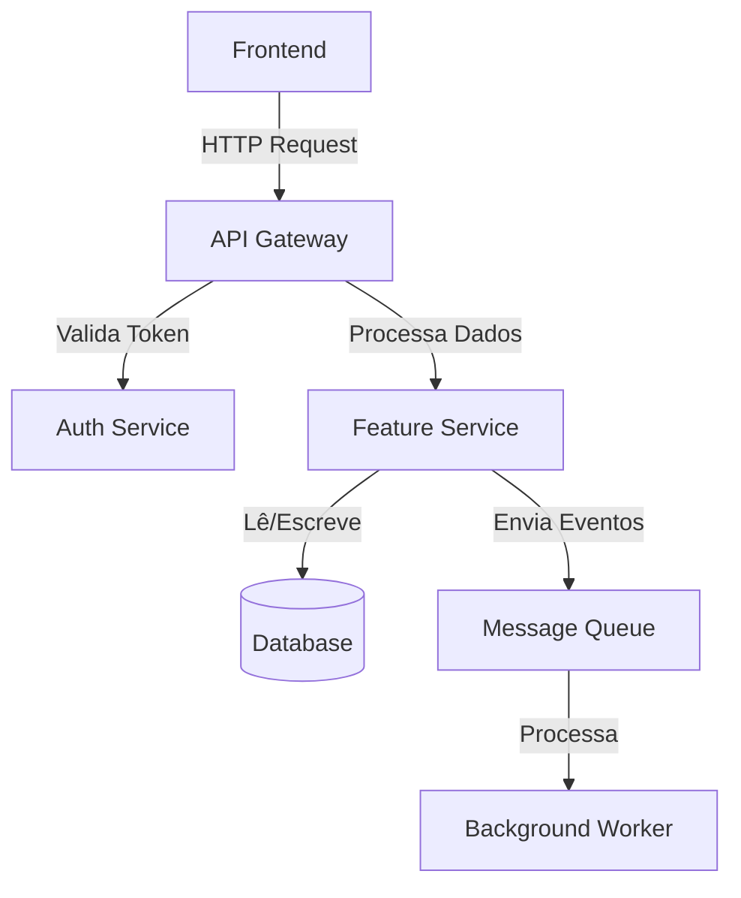
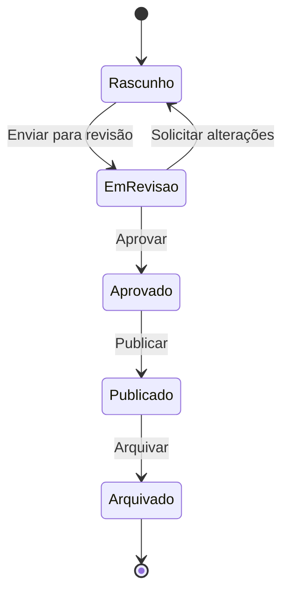
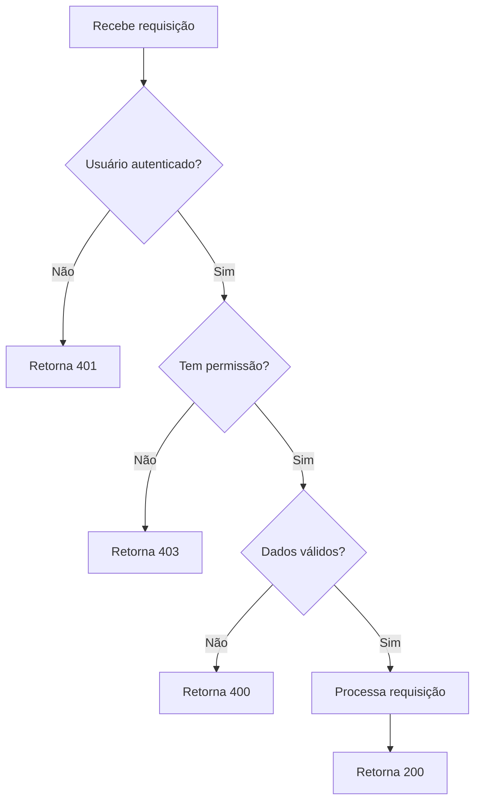

Na correria do dia a dia, a documentação de uma feature pode ser esquecida.

**MAS**, escrever documentação salva muito tempo no futuro! Ajudando outros desenvolvedores ou pessoas não-técnicas a entender o que foi feito ali. Na verdade, pode até servir de referência pra você mesmo no futuro.

(Quem nunca ficou com dúvida em um código, foi ver e quem tinha feito aquele código era você mesmo?)

Nesse artigo, vou passar algumas dicas sobre escrever documentação!

## 1 — Entenda seu público alvo e seja acessível

Na maioria das vezes, seu público-alvo será desenvolvedores, e você escreverá documentação técnica. Contudo, há níveis entre eles. Pode haver um especialista na sua feature e um iniciante que está um pouco perdido.

Além disso, seu público alvo também poderá incluir pessoas que não são técnicas. Entenda essa realidade e adapte seu material para que fique o mais acessível possível.

**Exemplo de trecho de uma documentação técnica para desenvolvedores:**

> _A nova funcionalidade permite que serviços externos realizem a autenticação pela API. Para isso, basta incluir a chave de acesso como Bearer Token no cabeçalho da requisição._

**Exemplo do mesmo trecho para documentação acessível (desenvolvedores + time interno):**

> _A nova funcionalidade irá permitir que serviços de integração se conectem ao sistema de forma segura usando tokens de autenticação._

**Outro exemplo, desta vez a comparação entre dois trechos da documentação do _Cloudflare_:**

✅ **Direto ao ponto:**

> _You can access the Cloudflare bindings and environment variables through the Adapter API._

😐 **Muito verboso:**

> _You have the possibility to gain access to all the Cloudflare bindings and utilize any previously configured environment variables through the Adapter API._

## 2 — Vá direto ao ponto

Isso pode parecer um pouco redundante, mas passa batido quando queremos deixar algo bem claro. Por vezes, podemos acabar dando algumas voltas desnecessárias.

Para entender melhor, gosto de usar um exemplo feito pela [Sarah Rainsberger](https://www.rainsberger.ca/about/):

**❌ Não faça isso:**

> _Para começar a usar essa funcionalidade, você precisará primeiro certificar-se de que instalou todas as dependências necessárias e então você poderá prosseguir com a configuração inicial do arquivo de configuração._

**✅ Faça isso:**

> _Instale as dependências e configure o arquivo inicial._

## 3 — Use recursos visuais para facilitar o entendimento

Diagramas e fluxogramas podem transformar uma explicação complexa em algo simples de entender.

O [Mermaid](https://mermaid.js.org/) é uma ferramenta excelente para isso, pois permite criar diagramas diretamente em Markdown, de forma simples e integrada a editores como **VS Code** e **Cursor**. Você pode gerar uma primeira versão automaticamente a partir do seu código ou documentação — inclusive com apoio de **IA** — e depois ajustar manualmente conforme necessário. Também é possível desenhar o fluxo antes mesmo do desenvolvimento, o que ajuda na organização do raciocínio e na comunicação com a equipe.

## Exemplo 1: Fluxo de autenticação

Imagine que você precisa documentar um fluxo de autenticação OAuth. Em vez de apenas texto, você pode criar um diagrama:

## Exemplo 2: Arquitetura de um sistema

Para documentar a arquitetura de uma feature, um diagrama de componentes é muito útil:

## Exemplo 3: Estados de uma feature

Para features com diferentes estados ou ciclos de vida:

## Exemplo 4: Processo de decisão

## 4 — Leia e aprenda com os melhores

Leia documentações de linguagens de programação/frameworks famosos, livros e conteúdo sobre escrita técnica. Com o tempo você vai perceber que isso vai influenciando na sua própria escrita.

Você pode até mesmo usar outras documentações públicas de inspiração (não no conteúdo, mas da forma que aquilo foi entregue para o leitor).

Muitos frameworks até mesmo possuem guias de documentação, relatando instruções como estilo de escrita e convenções a serem seguidas. Esses exemplos você pode usar pra criar algo do tipo no seu time, ou usar como base quando for escrever.

## Exemplos da vida real

### Stripe

A [documentação da API do Stripe](https://stripe.com/docs/api) é um excelente exemplo de documentação técnica clara:

*   Cada endpoint tem exemplos de código em várias linguagens
*   Sidebar organizada por recursos
*   Exemplos de request e response lado a lado
*   Explicação clara de cada parâmetro com tipos de dados

### Laravel

Eu curto muito a [documentação do Laravel](https://laravel.com/docs), e ela tem um estilo mais narrativo e opinativo também:

*   Explica não apenas “como”, mas “por quê”
*   Usa exemplos práticos do mundo real
*   Código bem comentado e contexto de uso
*   Seções sobre melhores práticas

## Recursos recomendados

Aqui algumas documentações e guias que gosto bastante:

**Guias de estilo:**

*   [Google Developers Style Guide](https://developers.google.com/style/accessibility)
*   [Google Inclusive Documentation](https://developers.google.com/style/inclusive-documentation)
*   [Google Voice and Tone](https://developers.google.com/style/voice)

**Documentações MUITO boas:**

*   [Laravel Documentation](https://laravel.com/docs/11.x/readme)
*   [Astro Documentation](https://docs.astro.build/pt-br/getting-started/)
*   [MDN Web Docs](https://developer.mozilla.org/)
*   [Rust Book](https://doc.rust-lang.org/book/)

**Guias de contribuição:**

*   [Astro — Guia de escrita](https://contribute.docs.astro.build/guides/writing-style/)

Além disso, recomendo fortemente esse artigo com 50 dicas sobre documentação:

*   [50 Docs Tips in 50 Days](https://www.rainsberger.ca/blog/50-docs-tips-in-50-days/)

## Conclusão

Documentar bem não é perder tempo, é investir no futuro do projeto e do time. Uma boa documentação:

*   Reduz o tempo de onboarding de novos desenvolvedores
*   Diminui interrupções para tirar dúvidas
*   Serve como fonte de verdade sobre decisões técnicas
*   Facilita manutenção futura (inclusive por você mesmo)

Comece simples, seja consistente e melhore com o tempo :)
