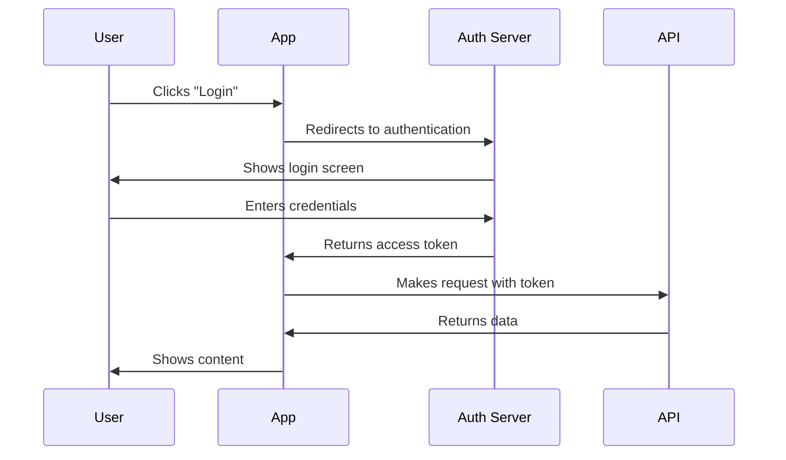
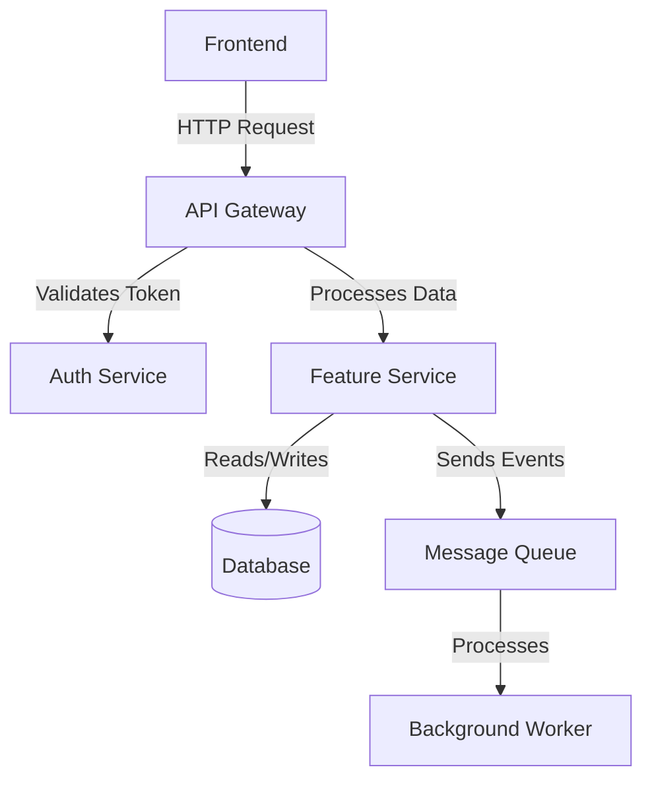
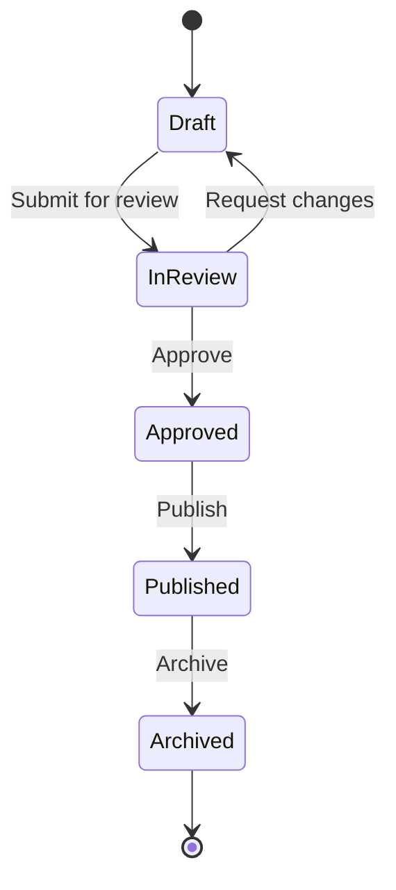
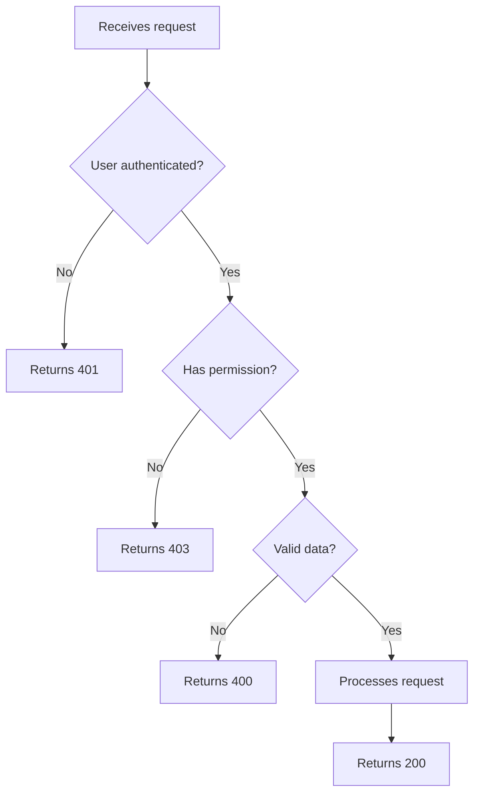

In the day-to-day rush, a feature's documentation can easily be forgotten.

**BUT**, writing documentation saves a lot of time in the future! It helps other developers or non-technical people understand what was done there. In fact, it can even serve as a reference for yourself in the future.

(Who hasn't had a question about some code, gone to check, and found out you were the one who wrote it?)

In this article, I'll share some tips on writing documentation!

## 1 — Understand your target audience and be accessible

Most of the time, your target audience will be developers, and you'll be writing technical documentation. However, there are levels among them. There may be an expert in your feature and a beginner who is a bit lost.

Your target audience may also include people who aren't technical. Understand this reality and adapt your material so it's as accessible as possible.

**Example of a technical documentation excerpt for developers:**

> _The new feature allows external services to authenticate via the API. To do this, just include the access key as a Bearer Token in the request header._

**Example of the same excerpt as accessible documentation (developers + internal team):**

> _The new feature will allow integration services to connect to the system securely using authentication tokens._

**Another example, this time comparing two excerpts from the _Cloudflare_ documentation:**

✅ **Straight to the point:**

> _You can access the Cloudflare bindings and environment variables through the Adapter API._

😐 **Too wordy:**

> _You have the possibility to gain access to all the Cloudflare bindings and utilize any previously configured environment variables through the Adapter API._

## 2 — Get straight to the point

This may seem a bit redundant, but it's easy to miss when we want to make something really clear. Sometimes we end up going in unnecessary circles.

I help translate Astro's documentation, and to explain this I like to use an example by their docs lead, [Sarah Rainsberger](https://www.rainsberger.ca/about/):

**❌ Don't do this:**

> _To start using this feature, you will first need to make sure that you have installed all the necessary dependencies and then you will be able to proceed with the initial setup of the configuration file._

**✅ Do this:**

> _Install the dependencies and set up the initial config file._

## 3 — Use visuals to make things easier to understand

Diagrams and flowcharts can turn a complex explanation into something simple to understand.

[Mermaid](https://mermaid.js.org/) is an excellent tool for this, since it lets you create diagrams directly in Markdown, simply and integrated with editors like **VS Code** and **Cursor**. You can generate a first version automatically from your code or documentation — including with help from **AI** — and then adjust it by hand as needed. You can also sketch the flow before development even starts, which helps organize your thinking and communicate with the team.

## Example 1: Authentication flow

Imagine you need to document an OAuth authentication flow. Instead of just text, you can create a diagram:

## Example 2: System architecture

To document a feature's architecture, a component diagram is very useful:

## Example 3: Feature states

For features with different states or lifecycles:

## Example 4: Decision process

## 4 — Read and learn from the best

Read documentation from well-known programming languages/frameworks, books and content about technical writing. Over time you'll notice it starts influencing your own writing.

You can even use other public documentation as inspiration (not the content, but the way it was delivered to the reader).

Many frameworks even have documentation guides, with instructions like writing style and conventions to follow. You can use these examples to create something similar for your team, or as a basis when you write.

## Real-life examples

### Stripe

The [Stripe API documentation](https://stripe.com/docs/api) is an excellent example of clear technical documentation:

*   Every endpoint has code examples in several languages
*   Sidebar organized by resource
*   Request and response examples side by side
*   Clear explanation of each parameter with data types

### Laravel

I really like the [Laravel documentation](https://laravel.com/docs), and it has a more narrative and opinionated style too:

*   Explains not just "how" but "why"
*   Uses practical, real-world examples
*   Well-commented code and usage context
*   Sections on best practices

## Recommended resources

Here are some docs and guides I really like:

**Style guides:**

*   [Google Developers Style Guide](https://developers.google.com/style/accessibility)
*   [Google Inclusive Documentation](https://developers.google.com/style/inclusive-documentation)
*   [Google Voice and Tone](https://developers.google.com/style/voice)

**REALLY good documentation:**

*   [Laravel Documentation](https://laravel.com/docs/11.x/readme)
*   [Astro Documentation](https://docs.astro.build/en/getting-started/)
*   [MDN Web Docs](https://developer.mozilla.org/)
*   [Rust Book](https://doc.rust-lang.org/book/)

**Contribution guides:**

*   [Astro — Writing style guide](https://contribute.docs.astro.build/guides/writing-style/)

I also highly recommend this article with 50 documentation tips:

*   [50 Docs Tips in 50 Days](https://www.rainsberger.ca/blog/50-docs-tips-in-50-days/)

## Conclusion

Documenting well isn't a waste of time, it's an investment in the future of the project and the team. Good documentation:

*   Cuts onboarding time for new developers
*   Reduces interruptions to answer questions
*   Serves as a source of truth for technical decisions
*   Makes future maintenance easier (including for yourself)

Start simple, be consistent and improve over time :)
